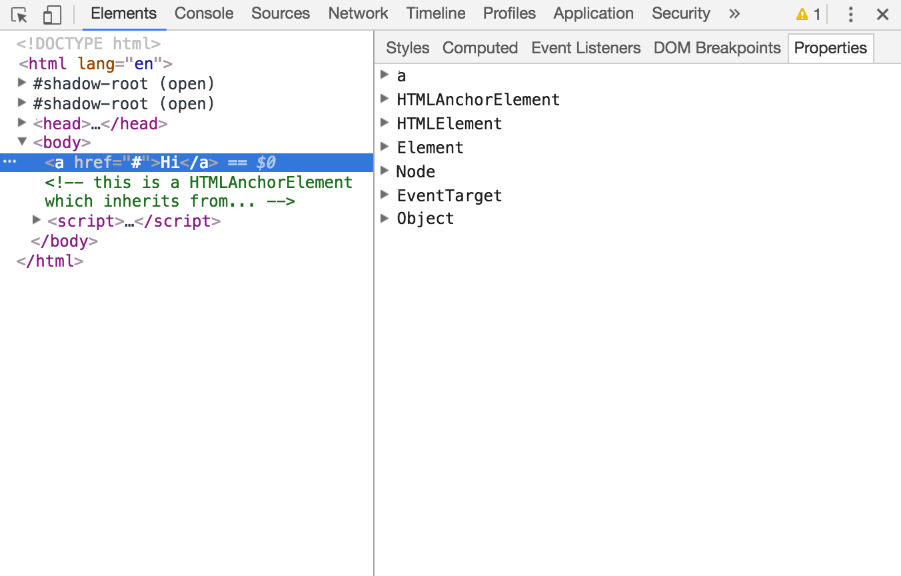

### 1.3 Subnode Objects Inherit From the Node Object

* Object < Node < Element < HTMLElement < (e.g., HTML*Element)
* Object < Node < Attr (this is deprecated in DOM4)
* Object < Node < CharacterData < Text
* Object < Node < Document < HTMLDocument
* Object < Node < DocumentFragment

