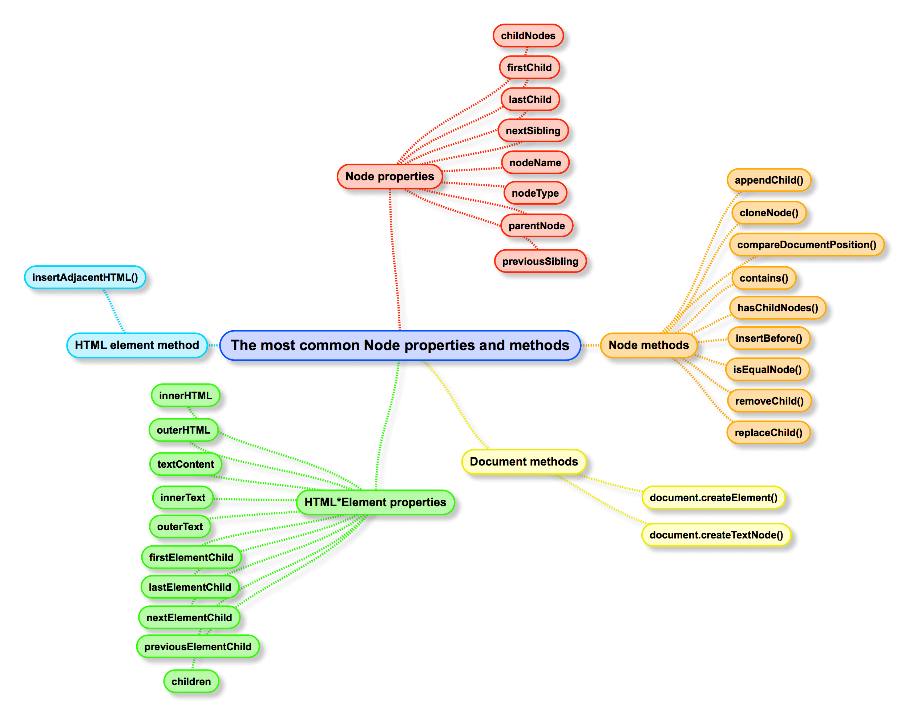

### 1.4 Properties and Methods for Working with Nodes

#### Node properties

* childNodes
* firstChild
* lastChild
* nextSibling
* nodeName
* nodeType
* nodeValue
* parentNode
* previousSibling

#### Node methods

* appendChild()
* cloneNode()
* compareDocumentPosition()
* contains()
* hasChildNodes()
* insertBefore()
* isEqualNode()
* removeChild()
* replaceChild()

#### Document methods

* document.createElement()
* document.createTextNode()

#### HTML*Element properties

* innerHTML
* outerHTML
* textContent
* innerText
* outerText
* firstElementChild
* lastElementChild
* nextElementChild
* previousElementChild
* children

#### HTML element method

* insertAdjacentHTML()